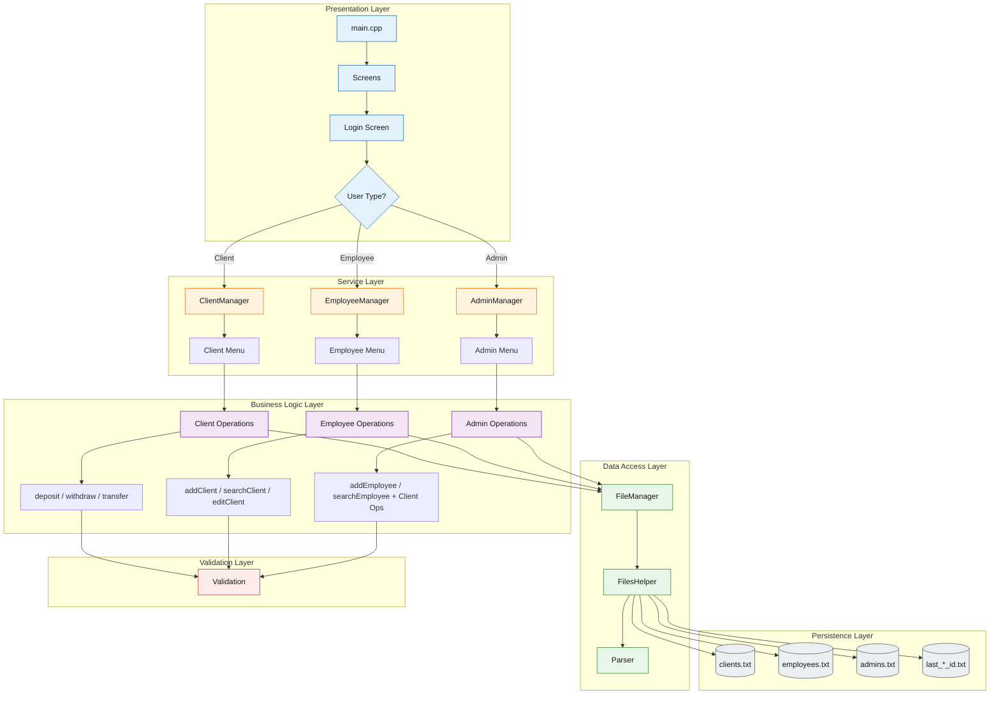
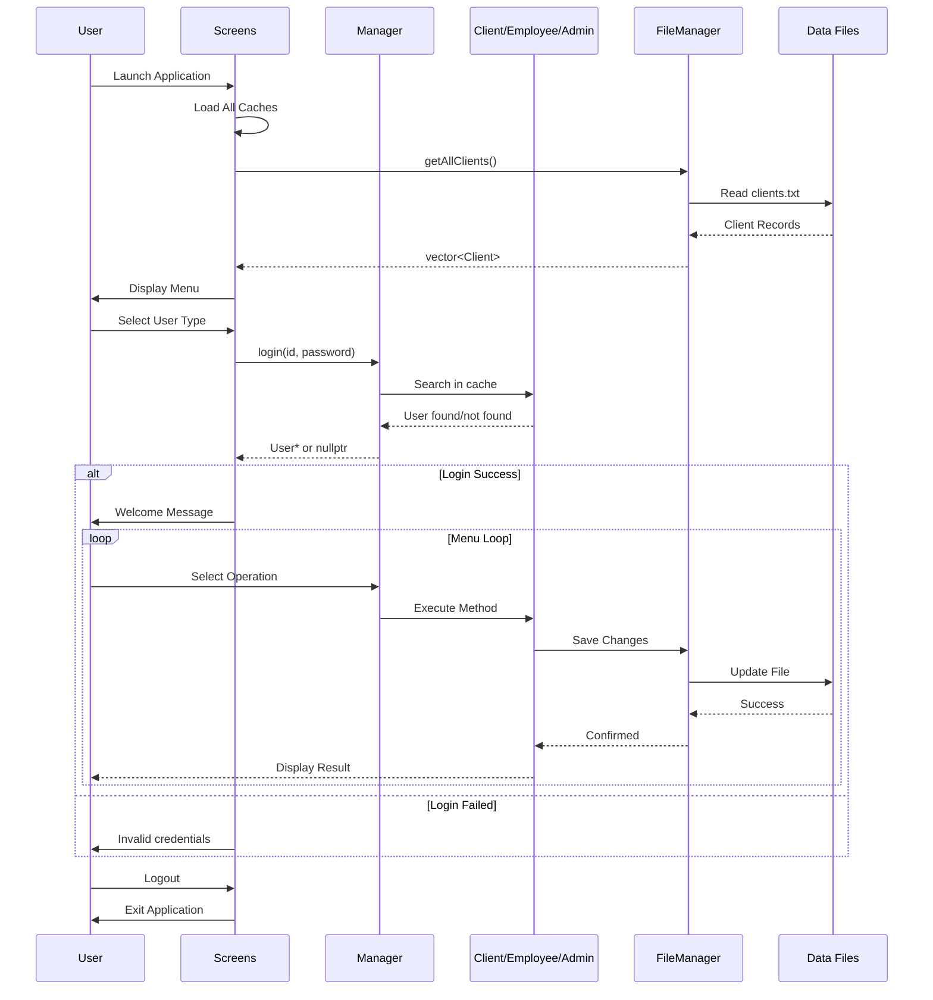
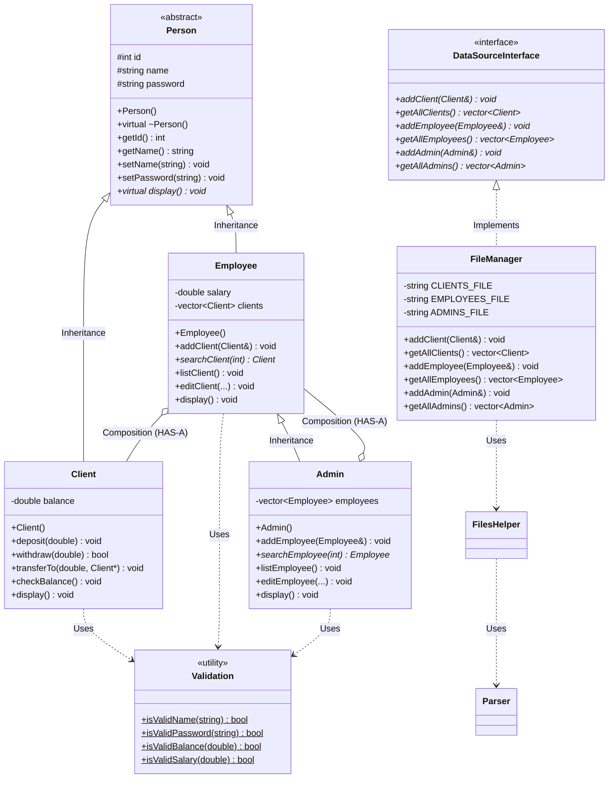
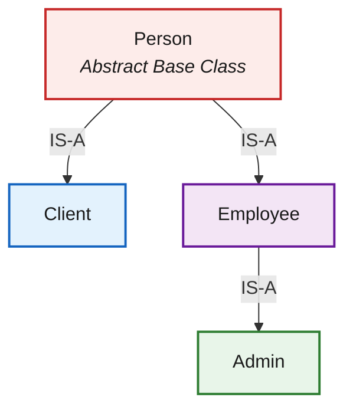
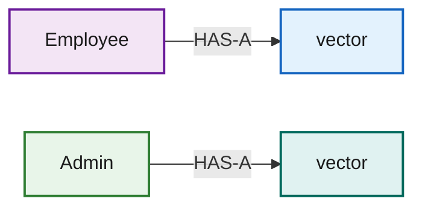

# Bank System — OOP Project

## Table of Contents
- [Architecture Overview](#architecture-overview)
- [System Workflow](#system-workflow)
- [OOP Principles & Relations](#oop-principles--relations)
- [Folder Structure](#folder-structure)
- [Class Hierarchy](#class-hierarchy)
- [Compilation](#compilation)
- [Test Credentials](#test-credentials)
- [Validation Rules](#validation-rules)

---

## Architecture Overview

A console-based bank management system implementing three distinct user roles: **Client**, **Employee**, and **Admin**. The project demonstrates professional application of object-oriented programming principles including inheritance, polymorphism, encapsulation, and abstraction.

> **Note:** This system uses file-based persistence with CSV format for data storage. All files are automatically managed in the `data/` directory.

## System Workflow

### Application Architecture Diagram



### User Interaction Flow



### Class Relationship Diagram



## OOP Principles & Relations

### 1. Encapsulation

**Definition:** Bundling data and methods that operate on that data within a single unit (class), while restricting direct access to internal state.

**Implementation in Project:**

| Class | Private Data | Public Interface | Location |
|-------|-------------|------------------|----------|
| `Person` | `id`, `name`, `password` | `getId()`, `getName()`, `setName()`, `setPassword()` | `src/models/Person.h` |
| `Client` | `balance` | `deposit()`, `withdraw()`, `getBalance()`, `setBalance()` | `src/models/Client.h` |
| `Employee` | `salary`, `clients` | `getSalary()`, `addClient()`, `searchClient()` | `src/models/Employee.h` |
| `Admin` | `employees` | `addEmployee()`, `searchEmployee()` | `src/models/Admin.h` |

> **Best Practice:** All member variables are `private` or `protected`. Access is controlled through getter/setter methods with built-in validation.

### 2. Inheritance (IS-A Relationship)

**Definition:** A mechanism where a new class derives properties and behaviors from an existing class.

**Implementation in Project:**



| Inheritance Type | Base Class | Derived Class | Inherited Members | Location |
|-----------------|------------|---------------|-------------------|----------|
| Single | `Person` | `Client` | id, name, password, display() | `src/models/Client.h:46` |
| Single | `Person` | `Employee` | id, name, password, display() | `src/models/Employee.h:47` |
| Multilevel | `Employee` | `Admin` | All Person + Employee members | `src/models/Admin.h:42` |

> **Key Insight:** `Admin` inherits from `Employee`, which means it automatically gets both Person AND Employee functionality (multilevel inheritance).

### 3. Polymorphism

**Definition:** The ability of different classes to respond to the same method call in different ways.

**Implementation in Project:**

#### Runtime Polymorphism (Virtual Functions)

| Virtual Method | Base Class | Overridden In | Purpose | Location |
|---------------|------------|---------------|---------|----------|
| `display()` | `Person` (pure virtual) | `Client`, `Employee`, `Admin` | Each class displays its specific information | `src/models/Person.h:66` |
| `~Person()` | `Person` | All derived classes | Proper cleanup in inheritance hierarchy | `src/models/Person.h:54` |

**Example Usage:**
```cpp
Person* p = &someClient;    // Upcasting
p->display();               // Calls Client::display() (polymorphism)
```

> **Technical Note:** The virtual destructor in `Person` ensures proper cleanup when deleting derived class objects through base class pointers.

#### Compile-time Polymorphism (Method Overloading)

| Method | Parameters | Purpose | Location |
|--------|-----------|---------|----------|
| `Client()` | Default constructor | Create empty client | `src/models/Client.cpp:7` |
| `Client()` | id, name, password, balance | Create initialized client | `src/models/Client.cpp:12` |

### 4. Abstraction

**Definition:** Hiding complex implementation details and exposing only essential features.

**Implementation in Project:**

#### Abstract Classes

| Class | Pure Virtual Methods | Purpose | Location |
|-------|---------------------|---------|----------|
| `Person` | `virtual void display() = 0` | Cannot instantiate Person directly; forces derived classes to implement display | `src/models/Person.h:42` |
| `DataSourceInterface` | 9 pure virtual methods | Separates data access interface from implementation | `src/core/DataSourceInterface.h:38` |

> **Design Pattern:** The `DataSourceInterface` demonstrates **Dependency Inversion Principle** - high-level modules depend on abstractions, not concrete implementations.

#### Implementation Hiding

| Layer | Abstraction Level | User Sees | Implementation Hidden |
|-------|------------------|-----------|---------------------|
| Screens | High-level UI | Login menu, operation choices | File I/O, data parsing, validation logic |
| Managers | Business logic | User operations (add, edit, search) | File paths, CSV format, caching mechanism |
| FileManager | Data access | Save/load methods | File streams, error handling, ID generation |

### 5. Composition (HAS-A Relationship)

**Definition:** A class contains objects of other classes as member variables.

**Implementation in Project:**

| Container Class | Contained Class | Relationship | Cardinality | Location |
|----------------|----------------|--------------|-------------|----------|
| `Employee` | `Client` | HAS-A (manages) | 1 Employee : N Clients | `src/models/Employee.h:51` |
| `Admin` | `Employee` | HAS-A (manages) | 1 Admin : N Employees | `src/models/Admin.h:47` |



> **Memory Management:** Composition using `std::vector` provides automatic memory management. When an Employee is destroyed, its clients vector is automatically cleaned up.

### 6. Dependency Injection

**Definition:** Supplying external dependencies to a class rather than creating them internally.

**Implementation in Project:**

| Class | Injected Dependency | Method | Benefit | Location |
|-------|-------------------|--------|---------|----------|
| `ClientManager` | `Client*` | `clientOptions(Client* client)` | Testability, flexibility | `src/services/ClientManager.h:62` |
| `EmployeeManager` | `Employee*` | `employeeOptions(Employee* emp)` | Decoupling | `src/services/EmployeeManager.h:61` |
| `AdminManager` | `Admin*` | `adminOptions(Admin* admin)` | Single Responsibility | `src/services/AdminManager.h:53` |

### Summary of OOP Principles Usage

| Principle | Count | Files Demonstrating |
|-----------|-------|-------------------|
| Encapsulation | 7 classes | Person, Client, Employee, Admin, Validation, Parser, FileManager |
| Inheritance | 3 relationships | Client→Person, Employee→Person, Admin→Employee |
| Polymorphism (Virtual) | 2 methods | display(), ~Person() |
| Polymorphism (Overloading) | 12+ methods | All constructors |
| Abstraction | 2 abstract classes | Person, DataSourceInterface |
| Composition | 2 relationships | Employee HAS Clients, Admin HAS Employees |
| Dependency Injection | 3 managers | ClientManager, EmployeeManager, AdminManager |

---

## Folder Structure

```
Bank_System/
├── data/                          # Runtime data files (auto-generated)
│   ├── clients.txt
│   ├── employees.txt
│   ├── admins.txt
│   ├── last_client_id.txt
│   ├── last_employee_id.txt
│   └── last_admin_id.txt
│
├── src/
│   ├── main.cpp                   # Entry point — calls Screens::runApp()
│   │
│   ├── models/                    # Domain entities (WHAT things ARE)
│   │   ├── Person.h / .cpp        # Abstract base: id, name, password
│   │   ├── Client.h / .cpp        # Person + balance + banking operations
│   │   ├── Employee.h / .cpp      # Person + salary + client management
│   │   └── Admin.h / .cpp         # Employee + employee management
│   │
│   ├── core/                      # Data layer (HOW data is stored/loaded)
│   │   ├── DataSourceInterface.h  # Abstract interface for persistence
│   │   ├── FileManager.h / .cpp   # Implements DataSourceInterface (files)
│   │   ├── FilesHelper.h / .cpp   # Low-level file I/O operations
│   │   └── Parser.h / .cpp        # String ↔ Object conversion
│   │
│   ├── services/                  # Business logic layer (WHAT happens)
│   │   ├── ClientManager.h / .cpp     # Client login + menu workflow
│   │   ├── EmployeeManager.h / .cpp   # Employee login + menu workflow
│   │   ├── AdminManager.h / .cpp      # Admin login + menu workflow
│   │   └── Screens.h / .cpp           # UI screens + main app loop
│   │
│   └── utils/                     # Shared utilities
│       └── Validation.h / .cpp    # Input validation (name, password, etc.)
│
├── Business Model/                # Requirements documentation (images)
├── build.bat                      # Windows compilation script
└── README.md
```

> **Directory Conventions:**
> - `models/` contains only data structures and their behaviors
> - `core/` handles all file I/O and data persistence
> - `services/` implements business logic and user workflows
> - `utils/` provides shared helper functions

## Class Hierarchy

```
Person (abstract)
  ├── Client        (has balance, banking operations)
  └── Employee      (has salary, manages clients)
        └── Admin   (manages employees + inherits client management)
```

> **Inheritance Strategy:**
> - `Person` is abstract (cannot be instantiated) - enforces polymorphism
> - `Client` and `Employee` are sibling classes inheriting from `Person`
> - `Admin` demonstrates multilevel inheritance (Admin → Employee → Person)

### Dependency Direction

```
Screens → Managers → Models
                  → Core (FileManager, Parser, FilesHelper)
                  → Utils (Validation)
```

> **Architecture Principle:** Dependencies flow **downward only**. 
> - Models never depend on Services
> - Services never depend on Screens
> - This ensures modularity and testability (Clean Architecture pattern)

---

## Compilation

> **Prerequisites:** C++11 compiler (g++, clang++, MSVC)

### Windows
```bash
build.bat
```

### Manual Compilation (All Platforms)

**Windows:**
```bash
g++ -std=c++11 -Wall -Wextra -o bank_system src/main.cpp ^
    src/models/Person.cpp src/models/Client.cpp ^
    src/models/Employee.cpp src/models/Admin.cpp ^
    src/core/FileManager.cpp src/core/FilesHelper.cpp src/core/Parser.cpp ^
    src/services/ClientManager.cpp src/services/EmployeeManager.cpp ^
    src/services/AdminManager.cpp src/services/Screens.cpp ^
    src/utils/Validation.cpp
```

**Linux/Mac:**
```bash
g++ -std=c++11 -Wall -Wextra -o bank_system src/main.cpp \
    src/models/Person.cpp src/models/Client.cpp \
    src/models/Employee.cpp src/models/Admin.cpp \
    src/core/FileManager.cpp src/core/FilesHelper.cpp src/core/Parser.cpp \
    src/services/ClientManager.cpp src/services/EmployeeManager.cpp \
    src/services/AdminManager.cpp src/services/Screens.cpp \
    src/utils/Validation.cpp
```

> **Compiler Flags Explained:**
> - `-std=c++11` : Use C++11 standard (required for auto, nullptr, range-based loops)
> - `-Wall` : Enable all common warnings
> - `-Wextra` : Enable additional warnings for better code quality

### Running the Application

**Windows:**
```bash
.\bank_system.exe
```

**Linux/Mac:**
```bash
./bank_system
```

> **Important:** Run the executable from the `Bank_System/` directory to ensure correct relative paths to the `data/` folder.

---

## Test Credentials

> **Quick Start:** Use these pre-configured accounts for immediate testing

### Client Accounts
| ID | Password | Balance |
|----|----------|---------|
| 1  | pass1234 | 5000.00 |
| 2  | mypass123 | 3000.00 |
| 3  | secure99 | 7500.00 |

### Employee Accounts
| ID | Password | Salary |
|----|----------|--------|
| 100 | emp12345 | 6000.00 |
| 101 | employee99 | 7500.00 |

### Admin Accounts
| ID | Password | Salary |
|----|----------|--------|
| 200 | admin1234 | 10000.00 |

---

## Usage Examples

### Client Operations

**Login Flow:**
1. Launch application
2. Select option `1` (Client Login)
3. Enter ID: `1`
4. Enter Password: `pass1234`

**Available Operations:**
- **Deposit money** - Add funds to account
- **Withdraw money** - Remove funds (validates minimum balance of 1500)
- **Transfer to another client** - Send money to another client by ID
- **Check balance** - Display current account balance
- **Update password** - Change account password (validates 8-20 characters)
- **Logout** - Return to main menu

> **Tip:** The transfer operation automatically validates both withdrawal and deposit, ensuring atomic transactions.

### Employee Operations

**Login Flow:**
1. Launch application
2. Select option `2` (Employee Login)
3. Enter ID: `100`
4. Enter Password: `emp12345`

**Available Operations:**
- **Add new clients** - Register new clients with validated input
- **List all clients** - Display all clients managed by this employee
- **Search for client** - Find client by ID
- **Edit client information** - Update name, password, or balance
- **Display employee info** - Show personal employee information
- **Logout** - Return to main menu

> **Note:** Each employee maintains their own list of clients. This demonstrates composition (Employee HAS-A collection of Clients).

### Admin Operations

**Login Flow:**
1. Launch application
2. Select option `3` (Admin Login)
3. Enter ID: `200`
4. Enter Password: `admin1234`

**Available Operations:**
- **All employee operations** - Inherited client management capabilities
- **Add new employees** - Register new bank employees
- **List all employees** - Display all employees in the system
- **Search for employee** - Find employee by ID
- **Edit employee information** - Update employee details
- **Display admin info** - Show personal admin information
- **Logout** - Return to main menu

> **Architecture Insight:** Admin inherits from Employee (IS-A relationship), automatically gaining all client management methods. This demonstrates the power of multilevel inheritance.

---

## Validation Rules

All input is validated using centralized `Validation` class (`src/utils/Validation.cpp`):

| Field | Rule | Example | Error Message |
|-------|------|---------|---------------|
| **Name** | 5-20 alphabetic characters, spaces allowed | `Ahmed Ali` | "Name must be 5-20 characters (alphabetic + spaces)" |
| **Password** | 8-20 characters | `pass1234` | "Password must be 8-20 characters" |
| **Client Balance** | Minimum 1500 | `2000.00` | "Balance must be at least 1500" |
| **Employee/Admin Salary** | Minimum 5000 | `6000.00` | "Salary must be at least 5000" |
| **Deposit/Withdraw Amount** | Must be positive | `500.00` | "Amount must be greater than 0" |

> **Best Practice:** Validation is enforced at multiple layers:
> 1. Input loop validation (prevents invalid entry)
> 2. Setter method validation (protects object state)
> 3. File save validation (ensures data integrity)

---

## File Structure

Data files are automatically created in the `data/` directory upon first use:

| File | Purpose | Format | Example Record |
|------|---------|--------|----------------|
| `clients.txt` | Client records | CSV | `1,Ahmed Ali,pass1234,5000.00` |
| `employees.txt` | Employee records | CSV | `100,Mohamed Hassan,emp12345,6000.00` |
| `admins.txt` | Admin records | CSV | `200,Sara Ahmed,admin1234,10000.00` |
| `last_client_id.txt` | Auto-increment ID tracker | Integer | `3` |
| `last_employee_id.txt` | Auto-increment ID tracker | Integer | `101` |
| `last_admin_id.txt` | Auto-increment ID tracker | Integer | `200` |

> **Data Persistence Strategy:**
> - CSV format for human readability
> - Append mode for new records (O(1) write)
> - Full file read for loading (cached in memory)
> - Separate ID trackers prevent duplicate IDs

---

## Project Phases

### Phase 1: Model Layer (COMPLETED)
**Deliverables:**
- Abstract `Person` class with encapsulation
- `Client` class with banking operations
- `Employee` class with client management
- `Admin` class with employee management
- `Validation` utility class

**OOP Concepts:** Inheritance, Encapsulation, Abstraction, Polymorphism

### Phase 2: Data Access Layer (COMPLETED)
**Deliverables:**
- `DataSourceInterface` abstraction
- `FileManager` implementation
- `FilesHelper` for low-level I/O
- `Parser` for CSV conversion

**OOP Concepts:** Abstraction (interface), Dependency Inversion

### Phase 3: Service Layer (COMPLETED)
**Deliverables:**
- `ClientManager` service
- `EmployeeManager` service
- `AdminManager` service
- `Screens` UI controller

**OOP Concepts:** Separation of Concerns, Dependency Injection, Static Service Pattern

